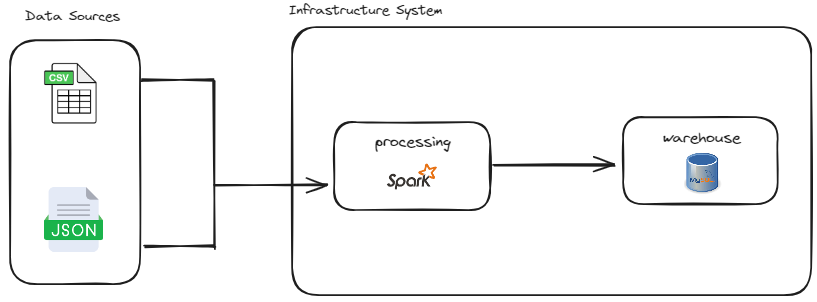

# Data Pipeline Engineering

## Task

Design an advance data pipeline that simulates real-world data (ingestion) for an e-commerce platform.

The pipeline must support and be able to handle

* Data schema evolution
* Incremental updates
* Handling various file formats

### Goals

Design a data pipeline that is:

* Scalable
* Fault-tolerant
* Efficient processing 


## Data Ingestion Pipeline

**Architecture**


A simple data pipeline achitecture was prefered for this project.

Apache spark was was sufficient to archeive the data extraction, transformation and loading needs.

### How It works

**Data Extraction**

The pipeline extracts data from the json and csv files using separate data loaders, which uses pysparks, csv and json loader functionalities.

The loader for the file is selected based on the file type. Predefined data scehemas are passed to the loader during the exraction process.

NB: Data is loaded into a spark dataframe and persisted in memory.

**Data Cleaning**

There were major data cleaning requirements for the data. The common issues were:
1. Commas in the notes column of the deliveries file. 
*   * This caused some text to span multiple columns.
*   * A script is run on the raw csv file to remove the extra commas in the notes column before loading with pyspark. 
2. Extra text surrounds order_ids in the deliveries file. 
* * This caused a mismatch with order_ids in orders table.
* * Extra text was striped from the text using regular expressions. NB. Functions (F) from pyspark is used for the row-wise cleaning, to enhance efficiency.
3. Column renaming.
* * Column names had spaces between words. eg `Order ID`
* * Column names were joined with `_` and lowercased. eg `order_id`

**Data Transformation**

Data transformation involved:
1. Enriching the data with the market information ie. market 1 or 2
* * A function extracts the market number from the file path and sets it as a literal in the newly created merket column.
2. Enriching the orders and deliveries data with customer information
* * Customer information is always ingested before orders and deliveries hence the customer table is queried from the database then joined with the extracted orders data based on the common `customer_id` column, The required columns from the customers table is then joined with that in the orders table and passed on for loading.
* * Deliveries data had no direct relationship with the customers data (by pk or fk) but shared `order_id` with the orders table. Hence the step performed above was executed, joining the orders and deliveries data and selecting the relevant customer data.

NB: A join between deliveries, orders and customers table could be acheived to extract user data from the customers table. But this step seems unneccesary given that the orders table also have the customer data.

NB: Data queried from the database for joining was persisted for consecutive queries.

**Data Loading**

A connection between pyspark and mysql server was established via the jdbc connector.

* Data is loaded in `append` mode.

A log of the file loading status is written to a log file. The metadata kept in the log file includes:
``` 
'last_modified': datetime the file was modified,
'last_data_processed': the last row written to the database,
'file_name': name of the file proccessed
```

**Data Updates**

Since the files resides on the local file system, the main run script, after initially loading the files for **ETL** watches the directory for changes to the files. The log file described previously is queried to check the last row proccessed, and only the new data added to the file is proccessed and loaded to the database.


### Data sources

Six data sources have been identified.
The data sources includes:
* Two JSON files with customer data informationm for market 1 and 2
* Four CSV files with information on delivery and orders information for market 1 and 2

The datasets are located in the local project file system.


## Tooling

**Apache Spark**

Apache Spark is preferred for its scalability, handling both small-scale and large-scale data processing tasks efficiently. Its in-memory processing capabilities enable high-speed data processing, making it suitable for real-time analytics and large-scale batch processing. Spark's flexible and expressive API supports complex data transformations and analytics operations, while its fault-tolerance mechanisms ensure reliable processing even in distributed environments. 

**MySQL**

MySQL database is used as a data warehouse.

**Reason for choice of database**

**Scalability**
* It offers features like replication, sharding, and clustering which allow you to scale your database horizontally or vertically depending on your needs. With proper configuration and optimization, MySQL can support high traffic and large datasets efficiently.

**Data Structure**
* MySQL provides a robust relational database model which is suitable for projects where data integrity and consistency are crucial. It supports various data types, indexes, constraints, and relationships (such as foreign keys) which allow you to model complex data structures accurately.

**Query Requirements**
* MySQL offers a powerful query language (SQL) with extensive support for complex queries, joins, subqueries, and aggregate functions. Its optimizer can efficiently handle queries of varying complexities, providing fast response times even for large datasets. 


### Runing the Pipeline
Run these commands to setup your project locally and on the cloud.

Note: Before running the pipeline ensure mysql server is up and running locally
```shell

# Clone the code as shown below.
git clone https://github.com/sethantanah/Data-pipeline-Individual.git
cd Data-pipeline-Individual

# Create a .env file with the following variables
DB_NAME='Ransbetty'
DB_USER='root'
DB_PASSWORD='*****'
DB_HOST='127.0.0.1'

# Local run
python src/run_data_pipeline.py
```

